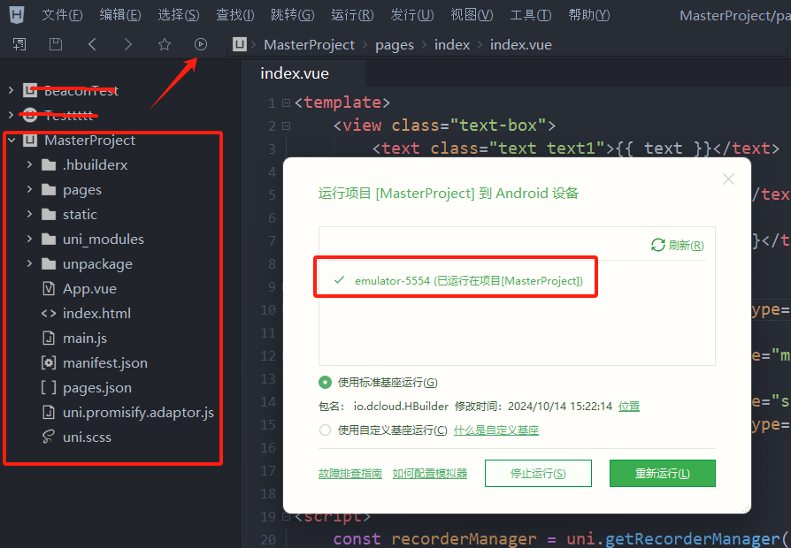
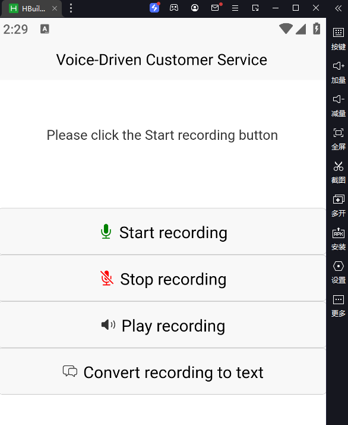
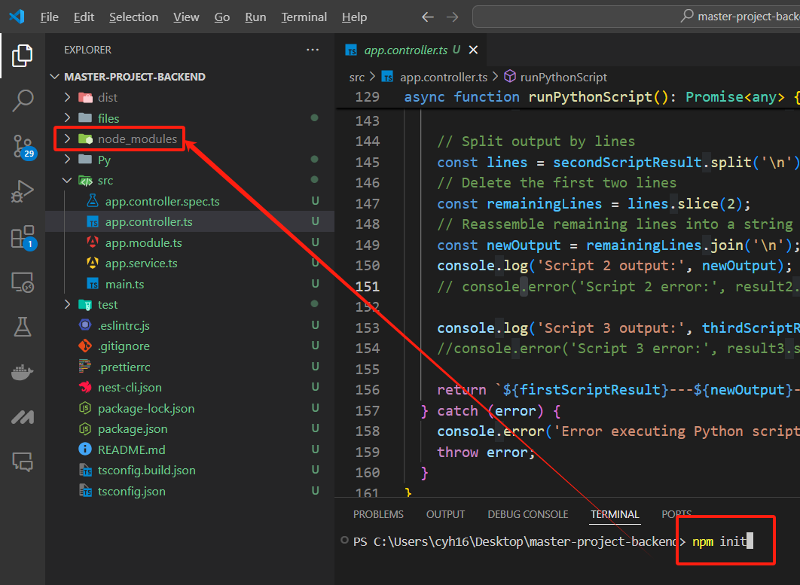
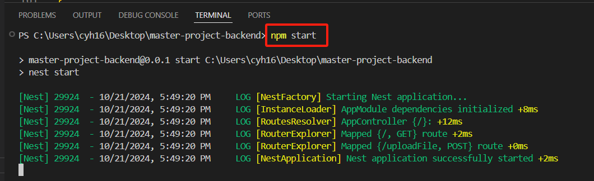
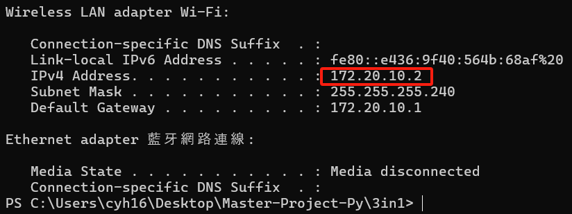
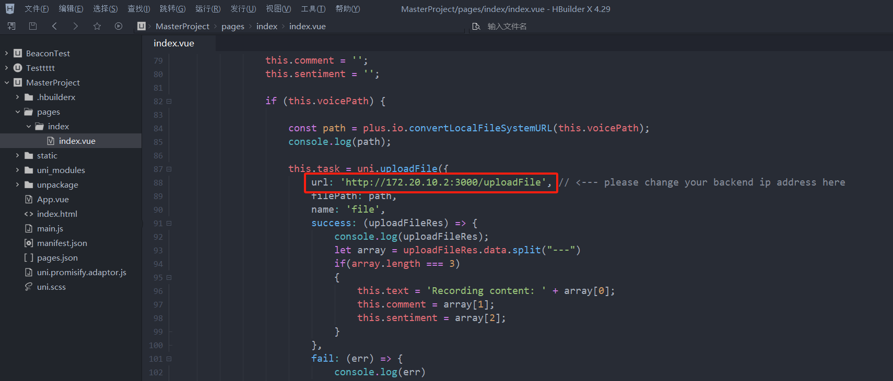

# MasterProject

## Description
The source code of this project is mainly divided into two parts: the front end and the back end. The front end is primarily developed using HBuilder X, while the back end is developed using Node.js and Nest.js. The Python scripts in the 'Python Script' folder are already included in the BackEnd/Py folder for easy reference to the relevant scripts.

## Front End setup
Step 1: Download HBuilder X and open the source code project in the FrontEnd folder.

Step 2: Install an Android emulator on your local machine, such as LDPlayer.

Step 3: In HBuilder X, click the run button and select 4. Run to Android App Base.

Step 4: Please ensure that the Android emulator is correctly opened on your local machine. Select the emulator from the list and click the run button.

Step 5: If everything is working correctly, the program will run properly in the emulator, as shown in the image below.

## Back End setup
Step 1: Please ensure that Node.js is correctly installed and configured on your local machine.

Step 2: Open the source code project in the BackEnd folder using Visual Studio Code.

Step 3: In the VS Code terminal, run the npm init command to download the necessary packages. Once the download is complete, a node_modules folder will be created in the root directory.

Step 4: Run the npm start command in the terminal to start the back end service.

Step 5: Please use the ipconfig command to determine your local machine's IP address.

Step 6: Open the front end project in HBuilder X. Open the pages/index/index.vue file and change the IP address on line 88 to your local machine's IP address, with the port number set to 3000.

