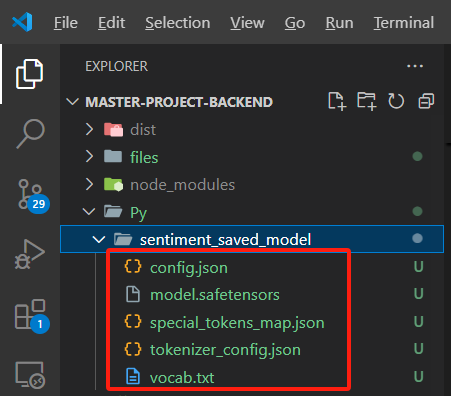

# MasterProject

## Description
The source code of this project is mainly divided into two parts: the front end and the back end. The front end is primarily developed using HBuilder X, while the back end is developed using Node.js and Nest.js. The Python scripts in the 'Python Script' folder are already included in the BackEnd/Py folder for easy reference to the relevant scripts.

## Front End setup
Step 1: Download HBuilder X and open the source code project in the FrontEnd folder.

Step 2: Install an Android emulator on your local machine, such as LDPlayer.

Step 3: In HBuilder X, click the run button and select 4. Run to Android App Base.

Step 4: Please ensure that the Android emulator is correctly opened on your local machine. Select the emulator from the list and click the run button.

Step 5: If everything is working correctly, the program will run properly in the emulator, as shown in the image below.

## Back End setup
Step 1: Please ensure that Node.js is correctly installed and configured on your local machine.

Step 2: Open the source code project in the BackEnd folder using Visual Studio Code.

Step 3: In the VS Code terminal, run the npm init command to download the necessary packages. Once the download is complete, a node_modules folder will be created in the root directory.

Step 4: Due to the large size of the model used for sentiment analysis, please download the model files using the following Google Drive link and place them in the Py/sentiment_saved_model folder of the back-end project.

https://drive.google.com/drive/folders/1kXglKVpGmoI0XZq0i53CSL9f_uQl7d7v?usp=drive_link

Run the npm start command in the terminal to start the back end service.

Step 5: Please use the ipconfig command to determine your local machine's IP address.

Step 6: Open the front end project in HBuilder X. Open the pages/index/index.vue file and change the IP address on line 88 to your local machine's IP address, with the port number set to 3000.

Step 7: Click the run button again in HBuilder X, and the app will be redeployed in the emulator.

At this point, you have successfully deployed and connected the front end and back end.

## How to Use the App
The app is mainly divided into the following five sections, which will be explained one by one regarding their functionalities.

1.First, you should click the "Start recording" button and clearly speak a sentence into your local microphone (currently only supports English).

2.Once you have finished speaking your sentence, please click the "Stop recording" button to stop the recording.

3.If you want to check the recording quality, you can click the "Play recording" button to listen to and verify the recent recording.

4.When the recording is confirmed to be correct, click the "Convert recording to text" button to send the audio for processing by the back end.

5.The process of sending the recording for back-end processing may take a few minutes. Once the results are generated on the back end, the app will display the analysis results for the current recording. The first line shows the transcription of the recording, while lines 2 to 4 present the analysis of accent, age, and gender. The fifth line provides the sentiment classification based on the transcription of the sentence.

## Introduction to the Core of the Program - Python Script
The Python scripts are mainly divided into three files. WeNet.py is responsible for converting audio to text. SoundClassification.py is used to analyze the speaker's gender, accent, and age based on the audio file; it includes functionalities for training and fine-tuning the model. Sentiment.py analyzes the sentiment level of the sentence based on the transcribed text. Normally, if the back-end interface is called correctly, the back end will automatically invoke each Python program in sequence to generate results. Of course, each Python script can also be run individually as needed. Below is an introduction to the usage of each file.

### WeNet.py
1.Modify the audio file path in the model.transcribe method.

2.Run the command 'python .\WeNet.py' to obtain the results.

### SoundClassification.py
#### Train Model

Run the command 'python .\SoundClassification.py --mode train --data-path validated.tsv' to train the model.

(For the validated.tsv file and the training audio files, please visit https://commonvoice.mozilla.org/en/datasets and select to download the Common Voice Corpus 3)

#### Fine Tune Model

Run the command 'python .\SoundClassification.py --mode fine-tune --model-path .\sound_classification_model.keras --data-path validated.tsv --voice-path output_file.wav --gender male --age thirties --accent hongkong' to fine-tune the model.

The required parameters are as follows:

--model-path: The path to the original trained model.

--data-path: The path to the dataset file downloaded from commonvoice.mozilla.

--voice-path: The path to the audio documents that need retraining.

--gender: The correct gender of the speaker.

--age: The correct age of the speaker.

--accent: The correct accent of the speaker.

#### Test Voice File

Run the command 'python .\SoundClassification.py --mode test --model-path .\sound_classification_model.keras --test-file .\output_file.wav' to test the voice file.

The required parameters are as follows:

--model-path: The path to the trained model.

--test-file: Path to the test audio file.
